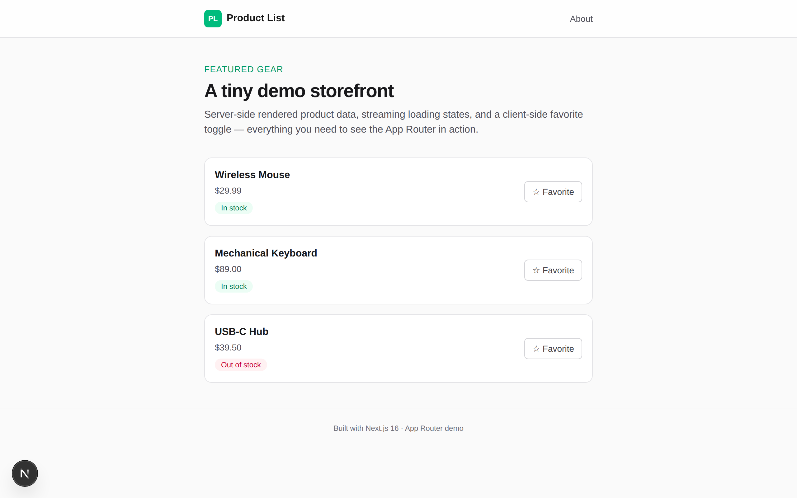

# Next.js Product List

A small, polished product-catalog demo built with the **Next.js App Router**. It shows off server-side rendered data fetching, a streaming loading state, file-based routing, and client-side interactivity — all in one tiny storefront.



## Tech Stack

- **Next.js 16** (App Router, Server Components)
- **React 19**
- **TypeScript**
- **Tailwind CSS 4**
- Package manager: **pnpm**

## Features

| Feature | Where it lives |
| --- | --- |
| Server-side data fetching with artificial latency | `app/page.tsx` (`getProducts`) |
| Streaming loading UI while data is in flight | `app/loading.tsx` |
| File-based routing (`/` and `/about`) | `app/page.tsx`, `app/about/page.tsx` |
| Custom 404 page | `app/not-found.tsx` |
| Client-side interactivity (favorite toggle) | `components/FavoriteButton.tsx` |
| Server + client component composition | `components/ProductCard.tsx` |

## Getting Started

```bash
pnpm install
pnpm dev
```

Open [http://localhost:3000](http://localhost:3000) — you'll see a skeleton loading state for ~1.5s, then the product list. Click **Favorite** (or **★ Favorited**) to see client-side state in action, and head to **About** for the routing demo.

## Other Scripts

```bash
pnpm build   # optimized production build
pnpm start   # serve the production build
pnpm lint    # ESLint
```

## About This Demo

This repo is a sandbox for testing the modern Next.js App Router. Each file is deliberately small and well-commented by its purpose, making it a useful reference for:

- Thinking in **server vs. client components**
- Adding **loading and not-found states** with zero config
- Styling a clean, responsive UI with **Tailwind** (light + dark mode)